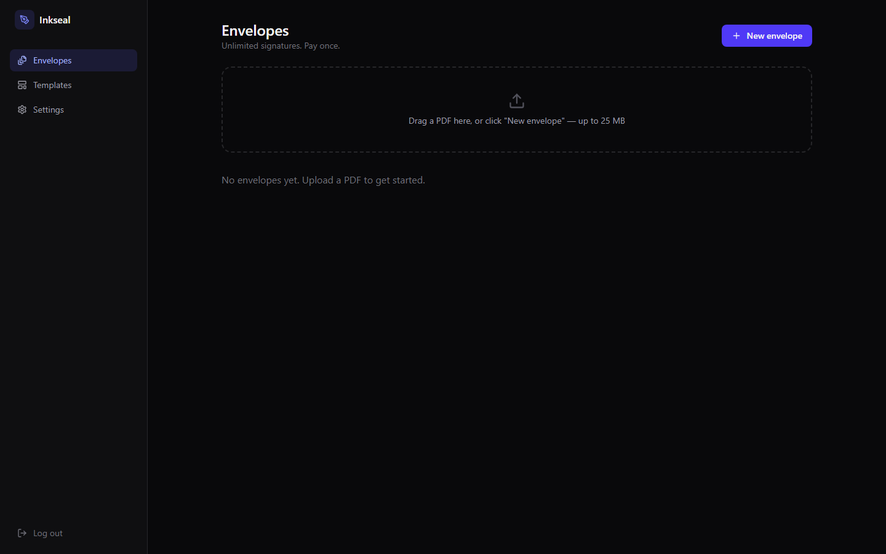

# ✍️ Inkseal


**Self-hosted e-signature platform. First document free. $59 once. Own it forever.**

DocuSign Personal caps you at 5 envelopes a month for **$10/mo** — and Standard is **$25/mo** for the features most small teams actually need. Inkseal is the same core workflow — upload a PDF, place signature fields, route it to signers in order or all at once, they sign in the browser, you get back a flattened, audit-trailed final document — running entirely on your machine or your own $5 VPS. Your **first document is completely free** (send it, collect every signature, download the final PDF). After that, one **$59 lifetime license** unlocks unlimited documents forever — no per-envelope fees, no monthly cap, ever.



## Features

- **Drag-and-drop field placement** — render any PDF with pdf.js, drop signature / initials / date / text fields onto the page, assign each to a signer (color-coded), mark required/optional
- **Sequential or parallel routing** — signer 2's link only activates after signer 1 finishes (or send to everyone at once)
- **Real signing experience** — signer opens a unique link, sees their fields highlighted, draws or types their signature, and must check an "I agree to sign electronically" box before finishing
- **Flattened final PDF** — signatures and text are actually embedded into the original PDF (via pdf-lib) at the exact recorded coordinates, plus an appended audit certificate page
- **Hash-chained audit trail** — every event (created, sent, viewed, consented, signed, completed, declined) records the UTC timestamp, signer name + email, IP address, and browser user agent, chained with `sha256(prev_hash + event)` and rooted in the original document's own SHA-256 (the final PDF's SHA-256 is recorded at completion); a one-click **Verify** recomputes the whole chain and tells you exactly where it breaks if it's ever tampered with
- **Certificate of Completion** — every final PDF gets an appended certificate page listing all signers (email, consent time, signing time) and the full audit trail with chain hashes
- **Templates** — save a document's field layout once, spin up new envelopes from it with fresh signers by role
- **Decline, void, and remind** flows
- **Email invitations** (BYO SMTP) — or just copy the signing link if you don't want to configure SMTP
- **100% local** — SQLite database, PDFs on disk, no telemetry, no external services

## Quick start (desktop app — recommended)

Runs as a normal desktop app. Data lives in your OS user profile; no password needed.

```bash
npm i
npm run build
npm run desktop
```

## Run as a web app (for your VPS)

Need signers to open links from anywhere? Deploy the exact same app to a $5 VPS:

```bash
npm i
npm run build
cp .env.example .env   # set ADMIN_PASSWORD!
npm start              # http://localhost:5334
```

Or with Docker:

```bash
docker compose up -d   # persists the SQLite db + signed PDFs in a named volume
```

> Run it as a desktop app, or deploy to a $5 VPS when you need signing links to be publicly reachable. Same code, same database schema — copy your `data/` folder between them any time.

## Pricing: first document free, then $59 once

Every install can create and **fully complete one envelope free** — send it,
collect all signatures, download the flattened PDF with its certificate page.
Creating a second envelope shows the upgrade screen: **$59 once — unlimited
documents forever**.

**→ Buy: [https://whop.com/benjisaiempire/inkseal](https://whop.com/benjisaiempire/inkseal)**

After purchase, Whop shows your license key (format `W-XXXXXX-XXXXXXXX-XXXXXXXW`)
in your hub at [whop.com/@me](https://whop.com/@me). Enter it in the upgrade
screen or under **Settings → License**. Keys are validated against Whop's
`validate_license` API and bound to the machine on first activation (reset the
binding any time at whop.com/@me).

> **Self-hosters / operator note:** server-side key validation requires the
> `WHOP_API_KEY` env var **and** a Software experience attached to the product
> in the Whop dashboard (without it, Whop doesn't issue license keys). If
> `WHOP_API_KEY` is unset, Inkseal accepts any well-formed Whop key and logs a
> warning — validation degrades gracefully rather than locking out paying
> customers.

## ☕ Skip the setup — get the 1-click installer

Want the packaged Windows installer with zero terminal time? The $59 license
includes the packaged build:

**→ [https://whop.com/benjisaiempire/inkseal](https://whop.com/benjisaiempire/inkseal)**

## vs DocuSign

| | Inkseal | DocuSign Personal | DocuSign Standard |
|---|---|---|---|
| Price | **$59 once** (first document free) | $10/mo ($120/yr) | $25/mo ($300/yr) |
| Envelopes | Unlimited | 5/month | Unlimited |
| Your data | On your machine/server | Their cloud | Their cloud |
| Multi-signer routing (sequential/parallel) | ✅ | ❌ | ✅ |
| Hash-chained, verifiable audit trail | ✅ | Proprietary | Proprietary |
| Templates | ✅ | ❌ | ✅ |
| Works offline (desktop mode) | ✅ | ❌ | ❌ |
| Source code | MIT, yours | ❌ | ❌ |

Five months of DocuSign Personal pays for this outright. Everything after that is free, forever. Also compare PandaDoc ($19/mo), SignWell ($8/mo), and Dropbox Sign ($15/mo) — same math.

## Compliance & legal validity (read this)

Inkseal implements the core requirements commonly associated with **ESIGN/UETA (US)** and basic **eIDAS "simple electronic signature"** validity: demonstrated intent via explicit click-to-sign actions, consumer consent capture ("I agree to sign electronically" — completion is refused and audit-logged without it), association of the signature with the record (signatures flattened into the PDF; audit chain rooted in the document's SHA-256), a tamper-evident audit trail (UTC timestamp, signer email, IP, user agent, hash chain per event + certificate page), and retention/copies for all parties.

It is **not** a Qualified Electronic Signature (eIDAS QES) — it does not use certificate-based digital signatures or a Qualified Trust Service Provider (QTSP), there is no KBA/ID verification, and **no compliance certification (SOC 2, ISO 27001, GDPR) is claimed**. Simple electronic signatures are fine for everyday agreements (leases, contracts, NDAs, internal approvals); legal sufficiency depends on your jurisdiction and document type. If you need QES or work in a regulated industry with specific e-signature requirements, consult a lawyer before relying on this for those use cases.

**Full details: [docs/COMPLIANCE.md](docs/COMPLIANCE.md)** — a requirement-by-requirement map of what the code actually records.

## Tech stack

- **Backend:** Node 20+, Express, better-sqlite3 (WAL), **pdf-lib** + `@pdf-lib/fontkit` (server-side PDF flattening — no headless browser), nodemailer, multer
- **Frontend:** React 19 + Vite 7, Tailwind CSS 4, Framer Motion, Lucide icons, **pdfjs-dist** for in-browser PDF rendering — dark mode by default (the public signing page is deliberately light-mode for trust/familiarity)
- **Desktop:** thin Electron wrapper (`electron/main.js`) that boots the same Express server on a free local port with data in the OS userData dir — auto-logged-in, offline-friendly
- **Storage:** single SQLite file + a `data/docs/` folder for original/signed PDFs (or Docker volume / Electron userData)
- **Typed signatures** are rendered in a bundled OFL script font ([Caveat](https://github.com/googlefonts/caveat), SIL Open Font License — see `fonts/Signature-OFL-LICENSE.txt`)

### The coordinate-mapping approach

pdf.js renders in CSS pixels, top-left origin, at an arbitrary zoom. pdf-lib places content in PDF points, bottom-left origin, in the page's *unrotated* coordinate space. Every field is stored as **fractions (0–1) of the pdf.js viewport at scale 1** — this bakes out zoom and `/Rotate` automatically on the display side. `server/coords.js`'s `toPdfSpace()` then transforms those fractions back into unrotated PDF-point space for any of the four page rotations (0/90/180/270) before pdf-lib draws the signature/text. It's covered by dedicated unit tests in `test/coords.test.js` — run first, before any UI code, because getting this wrong silently misplaces every signature.

## Configuration

| Env var | Default | Purpose |
|---|---|---|
| `PORT` | `5334` | HTTP port (web mode) |
| `ADMIN_PASSWORD` | `changeme` | Dashboard login (web mode; desktop mode skips login) |
| `DATA_DIR` | `./data` | SQLite db + uploaded/signed PDFs |
| `BASE_URL` | request host | Base URL used in signing invitation emails |
| `WHOP_API_KEY` | unset | Whop API key for server-side license validation. Unset = well-formed keys accepted with a logged warning (requires the Software experience attached in the Whop dashboard to be enforceable) |

SMTP is configured in-app under **Settings** and stored in the database. Without it, signing links are shown in the UI to copy/paste manually — envelopes still complete and download normally.

## Development

```bash
npm start        # API on :5334
npm run dev      # Vite dev server on :5335 (proxies /api)
npm test         # coordinate-mapping unit tests + full API smoke test
```

`npm run dist` builds the Windows NSIS installer (electron-builder).

## License

MIT — see [LICENSE](LICENSE). Signature font (`fonts/Signature.woff2`, Caveat) is SIL OFL 1.1 — see `fonts/Signature-OFL-LICENSE.txt`.

## macOS build

See [MAC-BUILD.md](MAC-BUILD.md). Quickest path: GitHub **Actions** tab -> run the **Mac Build** (`mac-build.yml`) workflow to get a downloadable `.dmg` (unsigned - right-click -> Open on first launch).
